# enoca-project

## Project Overview

Enoca project has two entity classes: Company and Employee. It also includes Dtos of those classes. We can access them from <code>'localhost:8080/api/'</code> . We have 7 endpoint belongs to this service.

| Method Type | Route | Parameters | Response | Description |
| ----------- | --------------------------------- | ------------------------- | ----------------------- |----------------------------------------------------- |
| POST | **/add** | RequestBody, AddEmployeeDto | None | Adds employee. |
| PUT | **/update** | RequestBody, EmployeeShowDto | None | Updates employee. |
| DELETE | **/delete/{employeeId}** | PathVariable, long employeeId | None | Deletes employee. |
| GET | **/findEmployee/{employeeId}** | PathVariable, long employeeId | EmployeeShowDto | Returns the desired employee.
| GET | **/findAllEmployee** | None | List\<EmployeeShowDto> | Returns all employees.
| GET | **/findAllCompany** | None | List\<CompanyDto> | Returns all companies.
| GET | **/findCompanyById/{companyId}** | PathVariable, long companyId | CompanyDto | Returns the desired company.

### Tests

**Database**

The database was created with "PostgreSQL".

 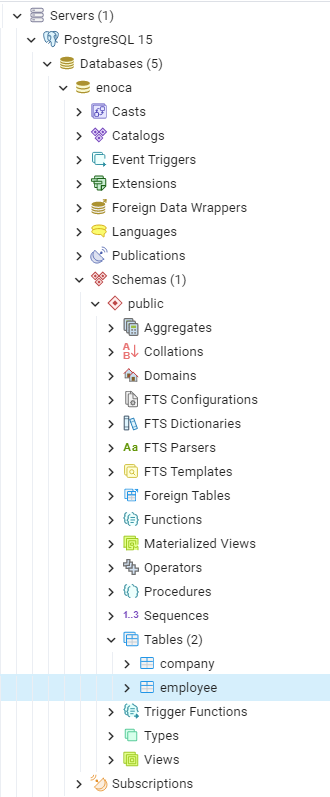

 

**Database Tables**

| company                                           | employee                                        |
| ---------------------------------------------------- | ------------------------------------------------- |
| 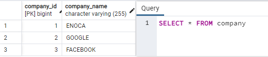 | 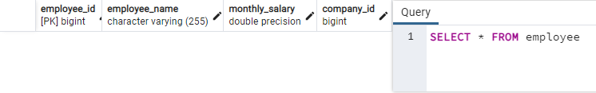 |

**localhost:8080/api/add**

| request                                          | request-2                                       |
| ---------------------------------------------------- | ------------------------------------------------- |
|  |  |

| request-3                                          | request-4                                       |
| ---------------------------------------------------- | ------------------------------------------------- |
| 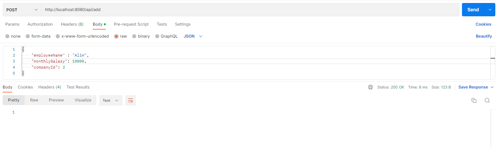 |  |

| request-5                                          | database                                      |
| ---------------------------------------------------- | ------------------------------------------------- |
|  | 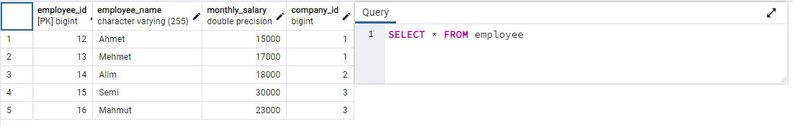 |

**localhost:8080/api/update**

| request                                          | database                                      |
| ---------------------------------------------------- | ------------------------------------------------- |
|  | 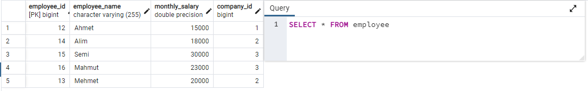 |

**localhost:8080/api/delete/{employeeId}**

| request                                          | database                                      |
| ---------------------------------------------------- | ------------------------------------------------- |
| 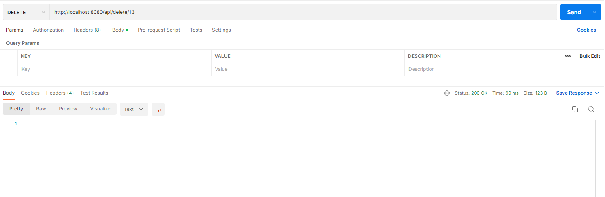 | 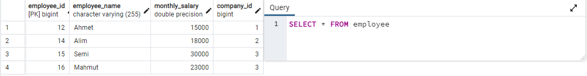 |

**localhost:8080/api/findEmployee/{employeeId}**

| request-response                                     |
| ----------------------------------------------------------------------------------------------------- |
| 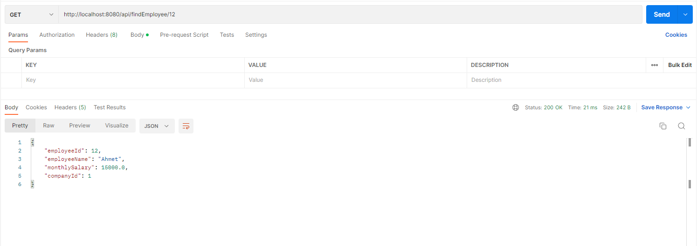  |

**localhost:8080/api/findAllEmployee**

| request-response                                     |
| ----------------------------------------------------------------------------------------------------- |
| 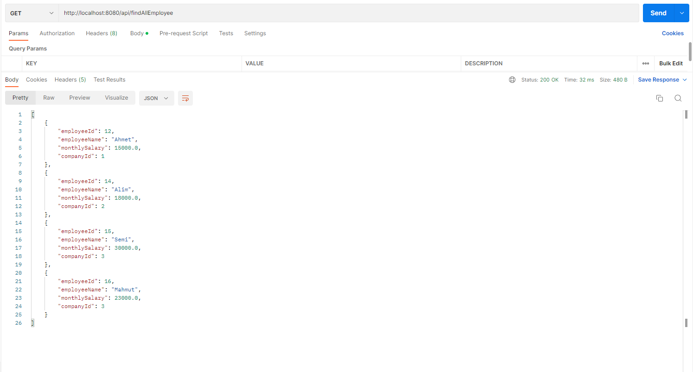  |

**localhost:8080/api/findAllCompany**

| request-response                                     |
| ----------------------------------------------------------------------------------------------------- |
| 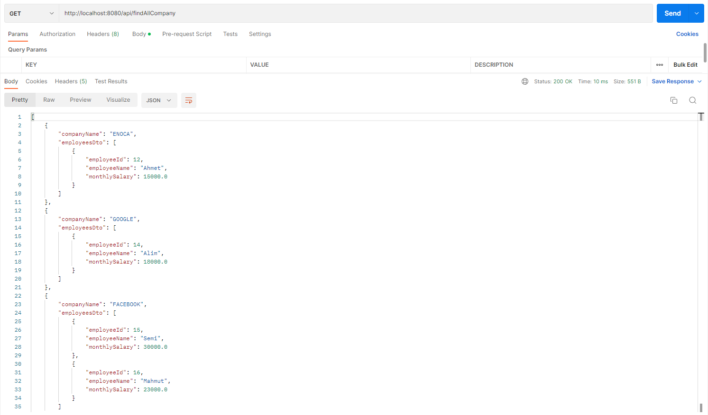  |

**localhost:8080/api/findCompanyById/{companyId}**

| request-response                                     |
| ----------------------------------------------------------------------------------------------------- |
|   |
